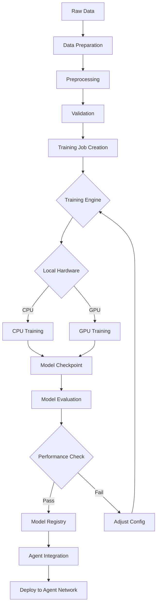

# Local Training & Fine-tuning System

## Overview

The **Adaptive Agent Nexus** is missing a critical component that would make it revolutionary: **local model training and fine-tuning capabilities**. This would transform it from an AI interface into a complete AI development platform.

## The Missing Piece: Local Training Infrastructure

### Current State
- ✅ Multi-agent AI system with McP workflow
- ✅ Real LLM integration (OpenAI, Anthropic, etc.)
- ✅ Agent specialization and coordination
- ✅ Continuous learning feedback loops
- ❌ **Local model training and fine-tuning**

### Vision: Democratize AI Training

**"The next leap in LLM models that anyone can run with existing LLMs but train locally"**

This would allow users to:
- **Fine-tune models** on their own data without cloud dependency
- **Create specialized agents** for specific domains/tasks
- **Maintain privacy** - training data never leaves the device
- **Continuous improvement** through local adaptation
- **Model ownership** - users control their trained models

## Proposed Training System Architecture

### Core Components

#### 1. **Training Data Management**
```typescript
interface TrainingDataset {
  id: string;
  name: string;
  type: 'conversational' | 'task-specific' | 'domain-knowledge';
  format: 'jsonl' | 'csv' | 'text';
  size: number;
  created: Date;
  lastModified: Date;
}

interface DataPreparationPipeline {
  rawData: File[];
  preprocessing: PreprocessingStep[];
  validation: ValidationRules;
  augmentation: AugmentationStrategy[];
}
```

#### 2. **Local Training Engine**
```typescript
interface TrainingJob {
  id: string;
  baseModel: string; // e.g., "llama-3-8b", "mistral-7b"
  dataset: TrainingDataset;
  config: TrainingConfig;
  status: 'queued' | 'running' | 'completed' | 'failed';
  progress: number;
  metrics: TrainingMetrics;
}

interface TrainingConfig {
  epochs: number;
  batchSize: number;
  learningRate: number;
  loraConfig?: LoraConfig;
  quantization?: '4bit' | '8bit' | 'none';
  hardware: 'cpu' | 'gpu' | 'auto';
}
```

#### 3. **Model Management System**
```typescript
interface LocalModel {
  id: string;
  name: string;
  baseModel: string;
  trainedOn: Date;
  size: number; // in MB
  performance: ModelMetrics;
  specialization: string[]; // domains/tasks
  version: string;
}

interface ModelRegistry {
  models: LocalModel[];
  activeModel: string;
  loadModel(modelId: string): Promise<void>;
  unloadModel(modelId: string): Promise<void>;
}
```

#### 4. **Fine-tuning Workflows**

##### **Agent-Specific Training**
```typescript
// Train specialized agents for specific roles
const researchAgentTraining = {
  baseModel: "llama-3-8b-instruct",
  dataset: researchConversationsDataset,
  specialization: ["research", "information-gathering"],
  trainingConfig: {
    epochs: 3,
    loraRank: 16,
    targetModules: ["q_proj", "k_proj", "v_proj", "o_proj"]
  }
};
```

##### **Domain Adaptation**
```typescript
// Fine-tune for specific domains
const medicalAgentTraining = {
  baseModel: "mistral-7b-instruct",
  dataset: medicalConversationsDataset,
  specialization: ["medical", "healthcare"],
  trainingConfig: {
    epochs: 5,
    domainAdaptation: true,
    preserveGeneralKnowledge: true
  }
};
```

### Training Pipeline



## Key Features to Implement

### 1. **Training Data Studio**
- **Data Import**: JSONL, CSV, text files
- **Data Cleaning**: Remove duplicates, filter quality
- **Data Augmentation**: Generate variations, synthetic data
- **Data Validation**: Format checking, quality metrics
- **Dataset Versioning**: Track changes and improvements

### 2. **Local Training Engine**
- **Framework Integration**: Support for llama.cpp, transformers.js
- **Hardware Acceleration**: GPU support via WebGPU, CPU optimization
- **Quantization**: 4-bit, 8-bit model compression
- **LoRA Fine-tuning**: Efficient parameter updates
- **Progress Tracking**: Real-time training metrics

### 3. **Model Management**
- **Model Storage**: Local filesystem with organization
- **Model Versioning**: Git-like versioning for models
- **Model Comparison**: A/B testing different versions
- **Model Export/Import**: Share models securely
- **Model Compression**: Optimize for deployment

### 4. **Continuous Learning**
- **Online Learning**: Update models from new interactions
- **Feedback Integration**: Use McP feedback for training
- **Incremental Training**: Add new knowledge without full retrain
- **Model Merging**: Combine multiple fine-tuned models

### 5. **Privacy & Security**
- **Local Processing**: All training happens on-device
- **Data Encryption**: Encrypt training data at rest
- **Model Encryption**: Protect trained models
- **Zero-Knowledge Training**: Never send data to external servers

## Integration with Existing System

### Enhanced Agent Training
```typescript
// Agents can now be trained for specific tasks
const customAgent = await createTrainedAgent({
  name: "Legal Assistant",
  baseModel: "llama-3-8b-instruct",
  trainingData: legalDocumentsDataset,
  specialization: ["legal", "contract-analysis"],
  continuousLearning: true
});
```

### McP Workflow Enhancement
```typescript
// Training becomes part of the McP feedback loop
const improvedAgent = await mcPWorkflow.enhanceAgent({
  agent: currentAgent,
  feedbackData: recentInteractions,
  trainingConfig: {
    epochs: 1,
    learningRate: 0.0001,
    incremental: true
  }
});
```

## Technical Implementation Plan

### Phase 1: Foundation (2-3 weeks)
1. **Data Management System**
   - Dataset import/export
   - Basic preprocessing
   - Data validation

2. **Model Registry**
   - Local model storage
   - Model metadata
   - Basic model loading

### Phase 2: Training Engine (3-4 weeks)
1. **CPU Training**
   - Basic fine-tuning with transformers.js
   - Progress tracking
   - Model saving/loading

2. **GPU Acceleration**
   - WebGPU integration
   - Hardware detection
   - Performance optimization

### Phase 3: Advanced Features (4-6 weeks)
1. **Continuous Learning**
   - Online training
   - Feedback integration
   - Incremental updates

2. **Model Optimization**
   - Quantization
   - LoRA fine-tuning
   - Model compression

### Phase 4: Ecosystem (2-3 weeks)
1. **Model Marketplace**
   - Share trained models
   - Model discovery
   - Community features

2. **Advanced Workflows**
   - Multi-model training
   - Ensemble methods
   - Custom training pipelines

## Impact & Benefits

### For Users
- **Privacy**: Train on sensitive data without cloud upload
- **Customization**: Create AI assistants tailored to specific needs
- **Cost**: No ongoing API costs after initial training
- **Ownership**: Full control over trained models

### For Developers
- **Innovation**: Build new AI applications locally
- **Research**: Experiment with training techniques
- **Deployment**: Self-contained AI solutions
- **Scalability**: Train once, deploy everywhere

### For Organizations
- **Data Security**: Keep sensitive data on-premises
- **Compliance**: Meet data residency requirements
- **Customization**: Domain-specific AI assistants
- **Cost Efficiency**: Reduce cloud AI costs

## Why This is Revolutionary

**Current State**: AI is cloud-dependent, expensive, and privacy-invasive
**Future State**: Local AI training empowers everyone to create custom AI

This transforms the Adaptive Agent Nexus from an AI interface into a complete AI development platform, democratizing access to advanced AI capabilities while maintaining user privacy and control.

**The missing piece isn't just a feature - it's the key to the next evolution of AI accessibility.**</content>
<parameter name="filePath">c:\Users\vinta\adaptive-agent-nexus\LOCAL_TRAINING_VISION.md